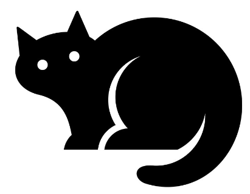

<a name="readme-top"></a>
# DevOps-Upskill-23
[](https://github.com/VikStoykov/DevOps-Upskill-23/actions/workflows/build_and_push_l4.yml)
[](https://github.com/VikStoykov/DevOps-Upskill-23/actions/workflows/editorconfig.yaml)
[](https://github.com/VikStoykov/DevOps-Upskill-23/actions/workflows/build_push_spec_task_k8.yml)

<!-- PROJECT LOGO -->
<br />
<div align="center">
  <a href="https://github.com/VikStoykov/DevOps-Upskill-23">
    
  </a>

  <h3 align="center">Telerik DevOps-Upskill 2023</h3>

  <p align="center">
    Public training repository for Telerik DevOps-Upskill program - 2023
    <br />
    <a href="docs/"><strong>Explore the docs »</strong></a>
    <br />
    <br />
    <a href="#">View Demo - TBD</a>
    ·
    <a href="https://github.com/VikStoykov/DevOps-Upskill-23/issues">Report Bug</a>
    ·
    <a href="https://github.com/VikStoykov/DevOps-Upskill-23/pulls">Request Feature</a>
    ·
    <a href="https://hub.docker.com/u/vikstoykov">Docker repository</a>
  </p>
  
</div>

<!-- ABOUT THE PROJECT -->
## About The Project

This is my main repository for 'Telerik DevOps-Upskill program 2023'.

Banches:
* main

<p align="right">(<a href="#readme-top">back to top</a>)</p>

### Used tools

Here you can find all tools and languages that are used in this project.

* Docker
* Ansible
* GitHub Workflows
* Terraform
* Slack
* Kubernetes
* Go/Bash/Python

<p align="right">(<a href="#readme-top">back to top</a>)</p>

<!-- GETTING STARTED -->
## Getting Started

If you want to run one of examples in 'homeworks', go to 'homeworks' directory and read instructions.

### Prerequisites

This is an example of how to list things you need to use the software and how to install them.
  ```sh
  sudo apt-get update
  sudo apt-get install docker.io
  sudo apt install software-properties-common
  sudo add-apt-repository --yes --update ppa:ansible/ansible
  sudo apt install ansible
  ```
  Terraform: https://developer.hashicorp.com/terraform/tutorials/aws-get-started/install-cli

### Installation

_Below is an example of how you can run ._


<p align="right">(<a href="#readme-top">back to top</a>)</p>


<!-- USAGE EXAMPLES -->
## Usage


_For more examples, please refer to the [Documentation](./docs)_

<p align="right">(<a href="#readme-top">back to top</a>)</p>

<!-- ROADMAP -->
## Roadmap

- [x] Idea for the project
  _CI/CD pipeline for own Kubevirt features_
  - [ ] _Phases of SDLC_
  - [ ] _Value stream mapping_
  - [ ] _Documentation_
  - [X] _Choose source control- GitHub_
  - [X] _Branching strategies_
- [x] Choosed building tools
  - _GoLang;_
  - _GitHub Actions;_
  - _Ansible;_
  - _Docker/DockerHub for sharing container images;_
  - _Snyk and Sonar for source code security source code testing._
- [x] Choosed languages and tools
  - _GoLang_ 
- [ ] Secrets management
  - [x] Ansible vault
  - [ ] HashiCorp vault
- [x] Security
  - [x] Sonarcloud
  - [x] Snyk
  - [x] Linters
  - [x] Gitleaks
- [x] ChatOps
  - [x] AWS Lambda
  - [x] AWS CloudWatch
  - [x] Slack
- [x] Create, build and test
  - [x] Build AWS custom AMI (_part of 'Configuration management'_)
  - [x] Create _patches for Kubevirt_
  - [x] Build _with GitHub Actions (Building Pipelines) and publish to DockerHub_
  - [x] Test _on AWS with Terraform_
- [x] Run on Kubernetes cluster
  - [x] AWS Custom AMI and EC2 instances
  - [x] Cluster with 2 or more workers
- [ ] Observability
  - [ ] Prometheus statistics
- [ ] REST API and WEB GUI support
- [ ] Test the project with one step
- [ ] Documentation 

See the [open issues](https://github.com/VikStoykov/DevOps-Upskill-23/issues?q=is%3Aopen+is%3Aissue) for a full list of proposed features (and known issues).

<p align="right">(<a href="#readme-top">back to top</a>)</p>


<!-- ROADMAP -->
## High-level design

Modified Kubevirt with cpu pinning
Create patch file and build Kubevirt
Deploy K8S cluster in AWS with terraform 

<p align="right">(<a href="#readme-top">back to top</a>)</p>


<!-- CONTRIBUTING -->
## Contributing

Contributions are what make the open source community such an amazing place to learn, inspire, and create. Any contributions you make are **greatly appreciated**.

If you have a suggestion that would make this better, please fork the repo and create a pull request. You can also simply open an issue with the tag "enhancement".
Don't forget to give the project a star! Thanks again!

1. Fork the Project
2. Create your Feature Branch (`git checkout -b feature/AmazingFeature`)
3. Commit your Changes (`git commit -m 'Add some AmazingFeature'`)
4. Push to the Branch (`git push origin feature/AmazingFeature`)
5. Open a Pull Request

<p align="right">(<a href="#readme-top">back to top</a>)</p>

<!-- LICENSE -->
## License

Distributed under the MIT License. See `LICENSE.txt` for more information.

<p align="right">(<a href="#readme-top">back to top</a>)</p>

<!-- CONTACT -->
## Contact

Viktor Stoykov

Project Link: [https://github.com/VikStoykov/DevOps-Upskill-23](https://github.com/VikStoykov/DevOps-Upskill-23)

<p align="right">(<a href="#readme-top">back to top</a>)</p>

<!-- MARKDOWN LINKS & IMAGES -->
[Docker.com]: https://img.shields.io/badge/docker-%230db7ed.svg?style=for-the-badge&logo=docker&logoColor=white
[Docker-url]: https://docker.com/
