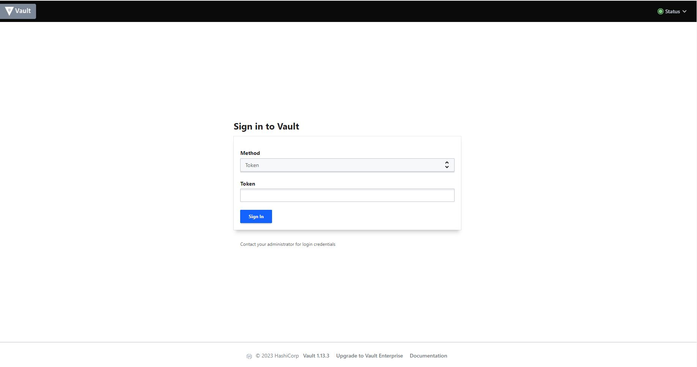
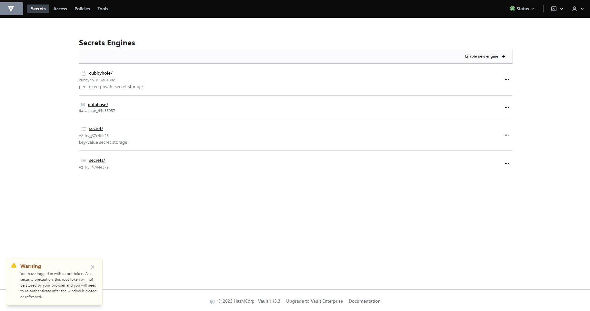
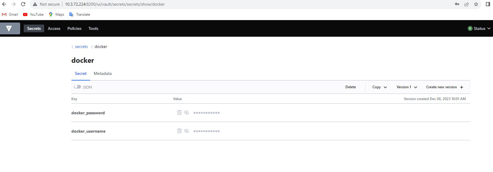
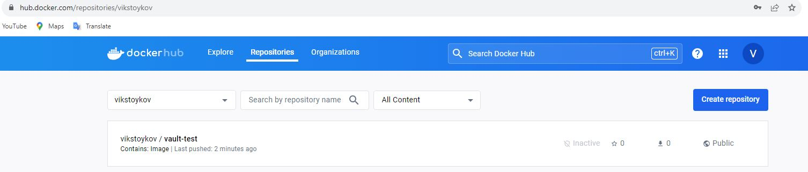

# Homeworks
[](https://github.com/VikStoykov/DevOps-Upskill-23/actions/workflows/build_and_push_l4.yml)

This is folder with all homeworks. For every homework you can find detailed information how to run it.

## How to run homework
### 1. lecture2-SDLC
Created with draw.io
***

### 2. lecture3-microservices
Do the Demo content in https://github.com/severel/telerik-devops-course/
***

### 3. lecture4-devops-programme
Original source code: https://github.com/vutoff/devops-programme
My pull request: https://github.com/vutoff/devops-programme/pull/11

```bash
$ sudo docker build -t test:v0.1 .

...
Successfully built 14fd734fcfc3
Successfully tagged test:v0.1

$ sudo docker images
REPOSITORY                                  TAG                     IMAGE ID       CREATED         SIZE
test                                        v0.1                    14fd734fcfc3   5 minutes ago   476MB
```

#### How to run it on Ubuntu 22.04 LTS
```bash
$ sudo docker build -t test:v0.1 .
2ff974622935c628227b58162eba6445d22cbba9272bd35a4f2dbe4992dd7a6e

$ sudo docker ps -a
CONTAINER ID   IMAGE            COMMAND                  CREATED         STATUS                       PORTS                                       NAMES
2ff974622935   test:v0.1        "python3 /app/app.py"    4 minutes ago   Up 4 minutes                 0.0.0.0:5000->5000/tcp, :::5000->5000/tcp   nifty_bose

$ netstat -nltp | grep 5000
tcp        0      0 0.0.0.0:5000            0.0.0.0:*               LISTEN      -

$ curl http://127.0.0.1:5000/
Hello, World!
```
***

### 4. lecture4-containers
#### Requirement
_1. Create an index.html file._<br />
_2. Create a Dockerfile that is based on nginx:1.20-alpine_<br />
_3. Copy the index.html file to the new nginx container_<br />
_4. Create a public image repository in docker hub_<br />
_5. Create a GitHub Actions workflow that builds the container and uploads the image to the repository_

Builder: [](https://github.com/VikStoykov/DevOps-Upskill-23/actions/workflows/build_and_push_l4.yml)
***

### 5. M1-3-Ansible
More info in [README.md](https://github.com/VikStoykov/DevOps-Upskill-23/tree/main/homeworks/M1-3-Ansible) in M1-3-Ansible folder

#### Requirement
Ansible, docker-py, flask (from requirements.txt) and authentication for DockerHub and GitHub via ssh. <br\>You can install requirements with pip install -r <i>requirements.txt</i> or manually for every packet.<br/>Builded image: https://hub.docker.com/r/vikstoykov/python-app/tags

#### How to run it:
ansible-playbook playbook.yaml
```
[WARNING]: No inventory was parsed, only implicit localhost is available
[WARNING]: provided hosts list is empty, only localhost is available. Note that the implicit localhost does not match 'all'

PLAY [localhost] ********************************************************************************************************************************
TASK [roles/build : Create code directory] ******************************************************************************************************
changed: [localhost]

TASK [roles/build : Get latest app code from GitHub] ********************************************************************************************
changed: [localhost]

TASK [roles/build : Build "vikstoykov/python-app:v0.1" image] ***********************************************************************************
changed: [localhost]

TASK [roles/build : Push "vikstoykov/python-app:v0.1" to docker hub] ****************************************************************************
changed: [localhost]

TASK [roles/build : Run container] **************************************************************************************************************
changed: [localhost]

TASK [roles/build : Test container] *************************************************************************************************************
changed: [localhost]

TASK [roles/build : debug] **********************************************************************************************************************
ok: [localhost] => {
    "command_output.stdout_lines": [
        "Hello, World!"
    ]
}

TASK [roles/build : Remove container] ***********************************************************************************************************
changed: [localhost]

TASK [roles/build : Remove "vikstoykov/python-app:v0.1" image] **********************************************************************************
changed: [localhost]

TASK [roles/build : Delete code directory] ******************************************************************************************************
changed: [localhost]

PLAY RECAP **************************************************************************************************************************************
localhost                  : ok=10   changed=9    unreachable=0    failed=0    skipped=0    rescued=0    ignored=0   
```
***
### 6. lecture7-secrets
More info in [README.md](https://github.com/VikStoykov/DevOps-Upskill-23/tree/main/homeworks/lecture7-secrets) in lecture7-secrets folder

#### Requirement
Docker compose. To install it, see demo in: https://docs.docker.com/compose/install/standalone/
```
sudo curl -SL https://github.com/docker/compose/releases/download/v2.23.3/docker-compose-linux-x86_64 -o /usr/local/bin/docker-compose
  % Total    % Received % Xferd  Average Speed   Time    Time     Time  Current
                                 Dload  Upload   Total   Spent    Left  Speed
  0     0    0     0    0     0      0      0 --:--:-- --:--:-- --:--:--     0
100 56.9M  100 56.9M    0     0  54.4M      0  0:00:01  0:00:01 --:--:--  109M

sudo chmod 777 /usr/local/bin/docker-compose

docker-compose version
Docker Compose version v2.23.3
```

Vault
https://developer.hashicorp.com/vault/downloads
```
 wget -O- https://apt.releases.hashicorp.com/gpg | sudo gpg --dearmor -o /usr/share/keyrings/hashicorp-archive-keyring.gpg
 echo "deb [signed-by=/usr/share/keyrings/hashicorp-archive-keyring.gpg] https://apt.releases.hashicorp.com $(lsb_release -cs) main" | sudo tee /etc/apt/sources.list.d/hashicorp.list
 sudo apt update && sudo apt install vault
```

#### How to run it:

In steps below we will creating Docker containers for Vault database. If you have problem:
```
vault-client-1  | /bin/sh: 1: ./run.sh: Permission denied
vault-client-1 exited with code 126
```
try to add credentials on <i>run.sh</i> and rebuild.

On this problem
```
fatal: [localhost]: FAILED! => {"msg": "An unhandled exception occurred while templating '{{ lookup('hashi_vault', 'secrets/data/dev:password') }}'. Error was a <class 'ansible.errors.AnsibleError'>, original message: An unhandled exception occurred while running the lookup plugin 'hashi_vault'. Error was a <class 'ansible.errors.AnsibleError'>, original message: Please pip install hvac to use the hashi_vault lookup module."}
```
try to add install hvac: <i>pip install hvac</i> and rerun playbook.yaml.

```
docker-compose create
[+] Running 20/20
 ✔ db 13 layers [⣿⣿⣿⣿⣿⣿⣿⣿⣿⣿⣿⣿⣿]      0B/0B      Pulled                                                                        8.2s 
   ✔ bb263680fed1 Pull complete                                                                                               0.9s 
   ✔ 75a54e59e691 Pull complete                                                                                               0.9s
   ...............................
 => => writing image sha256:266f3572ab480111a88cddab87971add8373da82eca4c7318aff0f783b163b7b                                  0.0s 
 => => naming to docker.io/library/lecture7-secrets-vault-client                                                              0.0s 
[+] Creating 4/1                                                                                                                   
 ✔ Network lecture7-secrets_vault-network     Created                                                                         0.1s 
 ✔ Container lecture7-secrets-db-1            Created                                                                         0.0s 
 ✔ Container lecture7-secrets-vault-client-1  Created                                                                         0.0s 
 ✔ Container lecture7-secrets-vault-server-1  Created                                                                         0.0s 

sudo docker ps -a
CONTAINER ID   IMAGE                           COMMAND                  CREATED         STATUS    PORTS     NAMES
4f1026d75a03   vault:1.13.3                    "docker-entrypoint.s…"   6 seconds ago   Created             lecture7-secrets-vault-server-1
d4286dd5d51b   lecture7-secrets-vault-client   "/bin/sh -c ./run.sh"    6 seconds ago   Created             lecture7-secrets-vault-client-1
331d7022a3ec   postgres:14.6                   "docker-entrypoint.s…"   6 seconds ago   Created             lecture7-secrets-db-1
```
<b>docker-compose up</b> to run environment.

After successfully creation of containers, need to run Vault server. Root token IS NOT FOR USING, but for our demo we will using this token.<br>What we have:<br>1 Vault server and 1 client.
1. <i>"vault-server-1  |     $ export VAULT_ADDR='http://0.0.0.0:8200'"</i> tell us that we have Vault server => everything is OK.
2. Login to Vault: vault-client-1  | + vault login token=my-very-secure-token
3. Enable secrets backend and secret credentials: <i>"vault-client-1  | + vault secrets enable -version=2 -path=secrets kv"</i>
4. Enable DB engine <i>"vault-client-1  | + echo 'Enable DB engine'"</i>

Now we can access Vault GUI via: <i>http://<our_IP_addr>:8200/ui/vault/secrets</i>





#### How it works
Create a database:
```yaml
  db:
    image: postgres:14.6
    ports:
      - "5432:5432"
    environment:
      POSTGRES_PASSWORD: "mypassword"
```
Create network:
```yaml
    networks:
      vault-network:
        ipv4_address: 172.21.0.30
        aliases:
          - db
```
Create Vault server and set to it `super secure token`
```yaml
  vault-server:
    image: vault:1.13.3
    ports:
      - "8200:8200"
    environment:
      VAULT_ADDR: "http://0.0.0.0:8200"
      VAULT_DEV_ROOT_TOKEN_ID: "my-very-secure-token"
    cap_add:
      - IPC_LOCK
```
Set it on already created network and configure to depend it on created DB.
```yaml
    networks:
      vault-network:
        ipv4_address: 172.21.0.10
        aliases:
          - vault-server
    depends_on:
      - "db"
```
The Vault client makes it works (provision the Vault server: `run.sh` script). In `run.sh` we are waiting to starting of Vault server and then trying to authenticate with our TOKEN. Then initializing backend and sets it to type 2 (in Vault we have 2 types of version: v1 without version control of secrets and v2 for version control). `Enable DB engine` step initialize for us DB backend and it allows to us to get dynamic secrets from Vault.

#### Test on Ansible:
_Create an Ansible vault. Store credentials to your Docker hub in that vault. Update the playbook you've created last time to use those credentials to login to your DockerHUB account to publish the built image. Open a PR and submit a link to ti. Remember - !!!do not publish your Ansible Vault password.!!!_

 1. Add username and password for Docker acc by Vault GUI
 

 2. Start playbook from _ansible_ directory
  <b>ansible-playbook playbook.yaml</b>
 ```
PLAY [localhost] **********************************************************************************************************************************************************************************************
TASK [Log into DockerHub] *************************************************************************************************************************************************************************************
ok: [localhost]

TASK [Build "vikstoykov/vault-test:v0.1" image] ***************************************************************************************************************************************************************
changed: [localhost]

TASK [Push "vikstoykov/vault-test:v0.1" to docker hub] ********************************************************************************************************************************************************
changed: [localhost]

PLAY RECAP ****************************************************************************************************************************************************************************************************
localhost                  : ok=3    changed=2    unreachable=0    failed=0    skipped=0    rescued=0    ignored=0   
 ```

3. Check image on DockerHub
 


